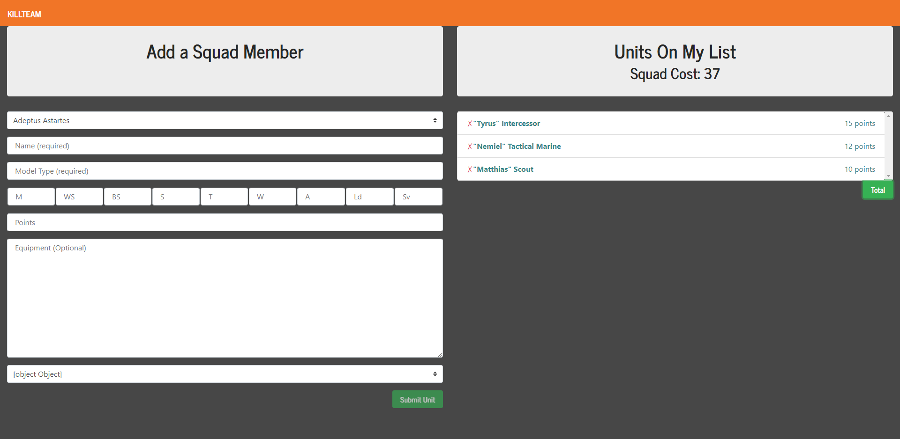
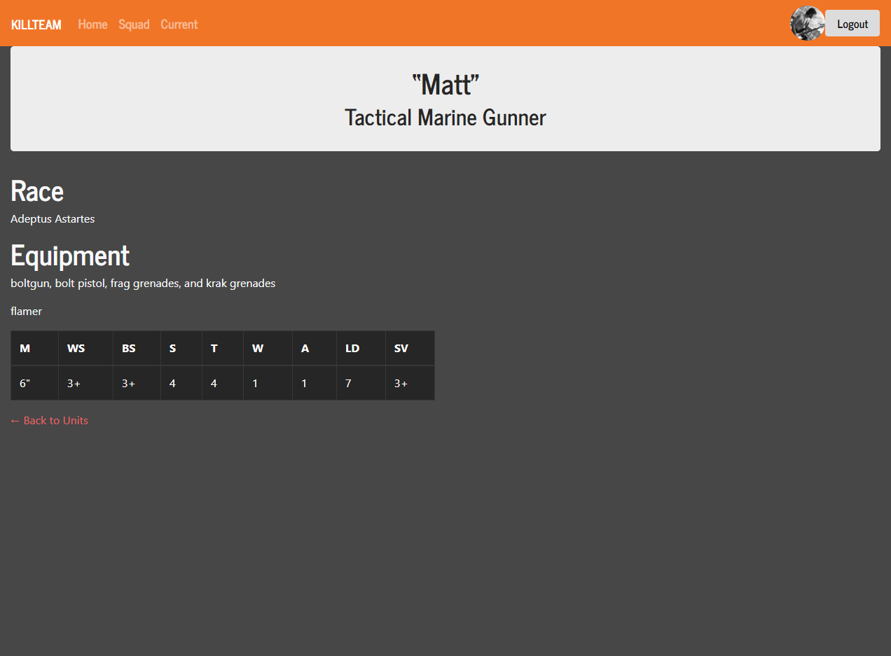
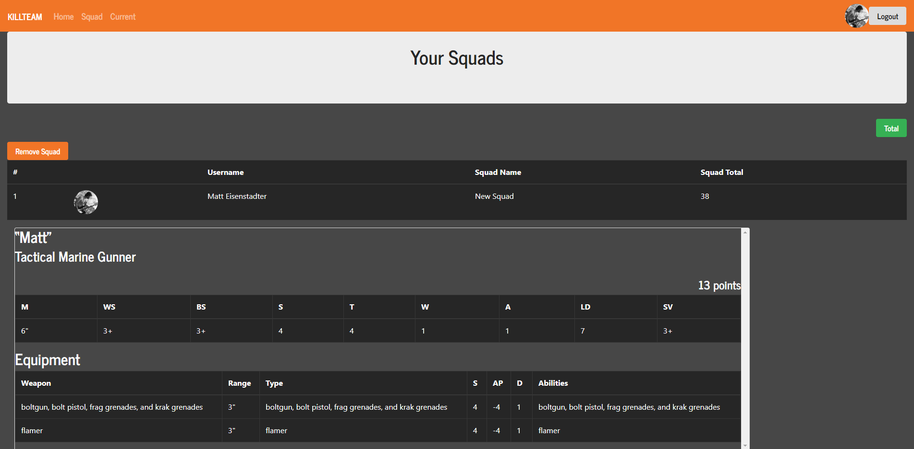

# KillTeam
Squad building app for the tabletop game Kill Team. React based app using Node and an mLab Mongo database to store entries. 

Deployed at http://kill-team.herokuapp.com

## Change Log:
01/06/2020
Release 0.5.2
* Reorganized guns.json to place grenades at bottom of equipment list.
* Fixed a bug where updating a unit would change the unit's id and cause errors.
* [Known issue] Delete All button is bugged.
* [Known issue] Updating a unit in the detail page will blank the screen. Unit does update correctly however.

11/14/2019
Release 0.5.1
* Detail page now updates in real time.
* Added ability to change Specialism in Detail page.
* Cleaned legacy code and console.logs.
* Various UI updates.

11/13/2019
Release 0.5.0
* Migrated the current list of units into session storage. Now multiple users can create a list at the same time.
* Added radio button selector for chapter/gender specific name generator.
* Moved dropdown option variables to their own .json files to reduce size of Units.js.

11/7/2019
Release 0.4.8
* Added Chapter specific names.
* Fixed a bug where the last name of the array was not being selected.

11/4/2019
Release 0.4.7
* Created step by step process for adding new squad member. User must select an option before the next option becomes visable
* Exported the random name variables to a .json file to reduce size of Units.js.
* Colored the background dark grey of input fields that can't be changed.

8/20/2019
Release 0.4.6
* Changed "Squad" to "Squads".
* Started to set up session dependent squad list.

7/11/2019
Release 0.4.5
* Fixed dependency vulnerabilities.
* Various stat/typo fixes.
* UI updated to fit correctly on 1920x1080.
* Fixed "expected to return a value at the end of arrow function" bug. Equipment should not try to render every single object from guns.json now.

6/29/2019
Release 0.4.4
* Added Specialists and Demeanour.
* Minor interface changes.

6/26/2019
Release 0.4.3
* Fixed various typos and stats.
* Finished fixing the update bug.

6/24/2019
Release 0.4.2
* Fixed wargear options for Deathwatch.
* Fixed the update bug where points would continually add to a unit that had its wargear updated.
* Added Squad Background, Mission, and Quirk.

6/20/2019
Release 0.4.1
* User can now update unit name, wargear, and options in their respective "detail" page (bug: multiple equipment updates on the same unit incorrectly adds additional points).
* Fixed the equipment display in the detail page.

6/4/2019
Release 0.4.0
* Added collapsing buttons to the squad page.
* Added tooltip functionality (no content yet).
* Prompts if no squad name is chosen.

6/3/2019
Release 0.3.9
* Fixed the random name generator to be switch case instead of if else statements.

4/23/2019
Release 0.3.8
* Updated pages to be more mobile responsive.
* User can no longer create mixed-race squads.
* Race no longer resets after a squad member is added.

4/18/2019
Release 0.3.7
* Fixed bug that prevented user from submitting units.
* Fixed Poxwalker not updating stats correctly.
* Fixed Other Options not displaying once an option was picked.

4/13/2019
Release 0.3.6
* Added icons to all the races options. Special thanks to TheMightyGoatMan for use of his icons. reddit.com/user/TheMightyGoatMan/

3/26/2019
Release 0.3.5
* Fixed various incorrect stats.
* Squad total now correctly updates.
* Unit list clears once submitted to the database.
* Added a Delete All button.

3/25/2019
Release 0.3.4
* Fixed various incorrect stats.
* Updated Detail View to match the new interface.
* Tweaked the interface.

3/25/2019
Release 0.3.3
* Added random names for all races.
* Updated some UI elements.
* Added Abilities to each Unit Type.

3/21/2019
Release 0.3.2
* Added a random name generator (Ultramarines only currently).
* Added an "Other Options" category for additional wargear.
* Fixed the autofill bug where user had to click twice.
* Selectors correctly clear when a new selection is picked.
* Wargear Options now update equipment list.

3/11/2019
Release 0.3.1
* Finished adding entries to guns.json.

3/7/2019
Release 0.2.9
* Squad page now correctly shows all equipment.
* Current page updated to also show equipment stats.
* Detail page bugged, does not show equipment stats correctly.
* Equipment added to guns.json.

3/5/2019
Release 0.2.8
* Squad page now shows equipment stats (bugged: only displays first item of equipment).
* Added equipment list JSON (only Astartes equipment so far).

2/28/2019
Release 0.2.7
* Squad page now correctly shows all squad members in a saved squad.
* Squad page now only shows squads based on user who is logged in.
* Equipment list now populates correctly in the table.

2/25/2019
Release 0.2.6
* Fixed navbar collapse button for small screens.
* Unit attribute numbers are read only inputs now.
* Autofill works on selection of unit type (bugged: must click twice to take effect).

2/11/2019
Release 0.2.5
* Login button moved to navbar.
* User must be logged in to see saved squads (bugged: currently all users' squads can be viewed by anyone).
* Fixed confirm prompt to allow unit delete cancel (bugged: prompt appears at the bottom of div).
* User can now delete squads from database.

1/30/2019
Release 0.2.4
* Finished Autofill stats for all races.

1/29/2019
Release 0.2.3
* Added a Current page to show a detail summary of the current squad.
* Fixed the Select inputs to correctly display selected item.

1/24/2019
Release 0.2.2
* Fixed Firebase user login.
* Persistant squads can be submitted to the database. Does not submit unless logged in: working as intended.
* Added ability to name squads.
* Squad page currently displays the current squad as well as squads in the database. Work in progress.

1/17/2019
Release 0.2.1
* Added Squad page to display the entire squad in detail view. Added a navbar button to access it.
* Added a usable Wargear Options selector which is dependent on unit type.
* Added Autofill stats for 4 more races.

1/9/2019
Release 0.1.4
* Added Firebase user login: currently bugged.
* Added custom favicon.

1/7/2019
Release 0.1.3
* Race selection displays in jumbotron.
* Model Types are now dependent on Race selection.
* Added all model types for each Race.
* Fixed npm package vulnerabilities.

12/31/2018
Release 0.1.2
* Army selector updated, now correctly saves to state.
* Added dropdown for all of the Model Types (Adeptus Astartes only so far).
* Added autofill stats based on Model Type.

11/15/2018
Release 0.1.1
* Fixed the text contrast on detail screen.
* Army selector updated, still not saving to detail screen.

10/25/2018
Release 0.1.0 is here!

## Known Issues:

* Tyranid Warrior options do not correctly update flesh hooks into Equipment.
* <s>Unit list does not correctly update when a squad of one is submitted or deleted using delete squad.</s> ✔️
* <s>Detail page does not display equipment correctly.</s> ✔️
* <s>User can create mixed-race squads.</s> ✔️
* <s>Other Options dropdown does not display selection.</s> ✔️
* <s>Squad total does not update correctly.</s> ✔️
* <s>Confirm prompt does not render in the correct location.</s> ✔️
* <s>Selectors don't register default state; you must select a new option then select the default for it to register.</s> ✔️
* <s>Squad page only displays first squad member for each squad.</s> ✔️
* <s>Navbar collapse bugged for small screens.</s> ✔️
* <s>Delete button alert does not have a cancel option.</s> ✔️
* <s>Poor text contrast on the detail screen.</s> ✔️
* <s>Equipment selector does not display correctly.</s> ✔️
* <s>Army selector does nothing currently.</s> ✔️
* <s>Login currently bugged.</s> ✔️

## Updates Planned:

* Save squads to PDF.
* Animations.
* Limits for specific unit types.
* More squad options (<s>specialists</s>, flesh wounds, experience, <s>demeanour</s>).
* UI graphics.
* <s>Random name generator allows Space Marine Chapter select.</s> ✔️
* <s>Delete the current squad when the submit squad button is clicked.</s> ✔️
* <s>Random name generator.</s> ✔️
* <s>Automatic squad totalling/Autofill stats.</s> ✔️
* <s>Correct Equipment Stats.</s> ✔️
* <s>Squad page only displays current user's squads.</s> ✔️
* <s>Login Button in the Navbar.</s> ✔️
* <s>Fix Squad page format.</s> ✔️
* <s>Model Type selector based on army choice.</s> ✔️
* <s>Autofill stats based on Model Type selected.</s> ✔️
* <s>Equipment selector.</s> ✔️
* <s>User login to save individual squads.</s> ✔️
* <s>Squad Name.</s> ✔️
